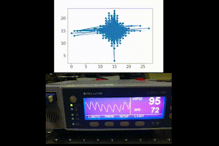
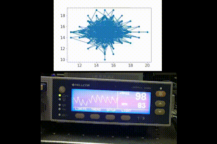
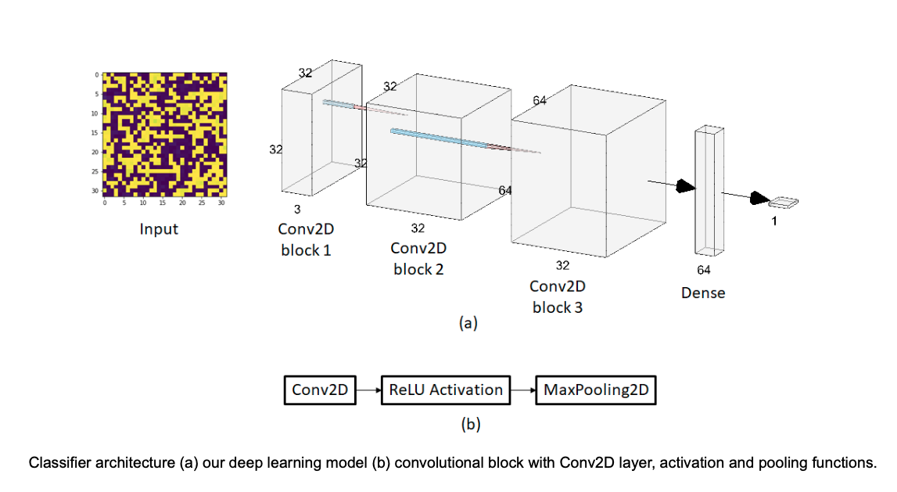
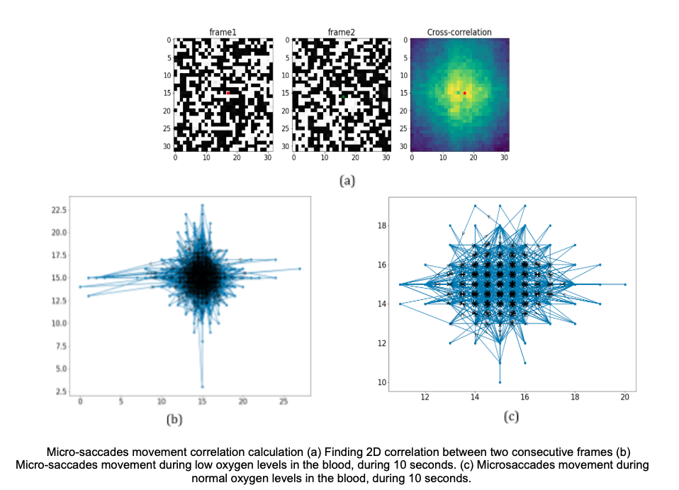
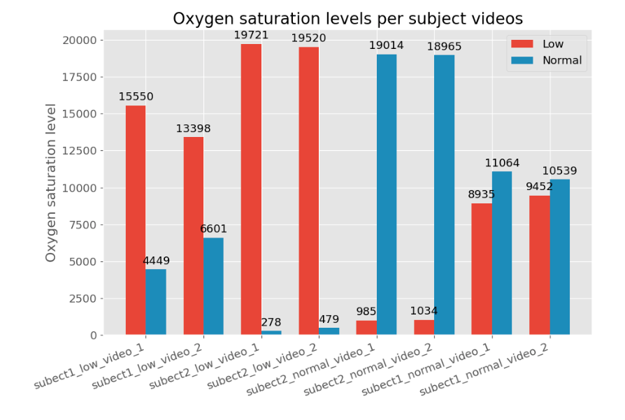

# SpO2-speckle
[Remote photonic sensing of blood oxygen saturation via tracking of anomalies in micro-saccades patterns paper]() Python implementation

### Abstract
The analysis of speckle patterns dynamics that is generated when laser light is back scattered from an
inspected tissue has recently been shown as applicable for remote sensing of various biomedical parameters. In this
work we present how analysis of a dynamic differential speckle patterns that are being scattered from subjects&#39;
sclera are analyzed to extract the micro-saccades movement of the eye and together with advanced machine learning
techniques, based on convolutional neural networks, can offer a novel approach to determine blood oxygen
saturation levels (SpO2) of subjects. Early stages of hypoxia can rapidly progress into pneumonia and death, and,
therefore, early and remote detection of low blood oxygen saturation levels can save lives.

### Data recording - speckle pattern and oximeter
#### low level oxygen level

#### normal level oxygen level

### Model

### Results on test-set

##### Model predictions on subjects test data:

